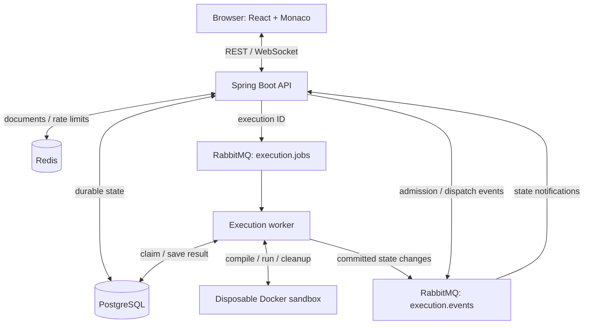

# PairForge

PairForge is a real-time collaborative coding and code-execution platform built
with Java/Spring Boot and React/TypeScript. Authenticated users join rooms by
invitation, edit together through WebSockets, and execute Java or Python
asynchronously through a RabbitMQ-backed worker that compiles and runs submissions
inside constrained disposable Docker containers.

PostgreSQL stores durable application state; Redis holds ephemeral collaborative
state. A separate worker isolates submitted-code execution from the API.
PairForge was deployed on AWS and validated through automated tests, bounded load
testing, encrypted backup/restore verification, and external beta testing.

[Local setup](docs/LOCAL_DEVELOPMENT.md) · [Architecture](docs/ARCHITECTURE.md) ·
[Testing](docs/TESTING.md) · [Measurements](docs/LOAD_TESTING.md#complete-aws-measurements--2026-09-28) ·
[Deployment](docs/DEPLOYMENT.md)

## Why PairForge

The focus is the backend behavior behind a shared editor: authorization on every
real-time interaction, asynchronous jobs that survive duplicate delivery, bounded
code execution, and recovery when dependencies or workers fail. One modular API
and one execution worker keep these tradeoffs small enough to test, measure and
explain.

## Architecture

One modular-monolith API owns authentication, rooms, browser connections and
execution admission. One separate worker owns code execution. PostgreSQL is the
durable record; Redis holds ephemeral collaboration state and rate limits.



## Measured results

AWS results represent **bounded portfolio/demo workloads, not sustained production
capacity**. Measurements were taken through CloudFront from
a desktop load generator. Collaboration and execution were measured separately
on the existing `t3a.medium` app host and `t3a.small` worker host.

| Measurement | Verified result |
| --- | --- |
| Collaboration workload | 2, 5 and 10 connections; three repetitions per stage |
| Expected update deliveries | **2,040 / 2,040** |
| Reconnect restoration | **9 / 9 passed** |
| Unexpected collaboration errors / disconnects | **0 / 0** |
| Ten-connection delivery latency | **47.84 ms p50 / 72.09 ms p95** |
| Execution submissions | **30 / 30 succeeded**, including six warm-ups |
| Small-batch throughput | **Java 0.339 jobs/sec; Python 1.123 jobs/sec** |
| Automated tests | **483 passed**, zero failures/errors/skips |
| External beta testers | **2** |

Both authenticated observers received every terminal execution result. Each
language had twelve measured jobs across three batches; the worker processed
one job at a time. Throughput excludes warm-ups and cooldowns and **does not
establish sustained system capacity**.

Two external testers completed registration/login, room admission, collaboration,
Java/Python execution, error handling and reload/reconnect checks on Chrome/PC.
This beta acceptance is based on owner-observed tester feedback. Retained backend
evidence is incomplete for some manual interactions; the [beta report](docs/BETA_TESTING.md#manual-beta-acceptance-evidence)
distinguishes those sources. No material product bugs were reported. Two testers
do not establish broad adoption or comprehensive browser coverage.

| Host | Peak sampled CPU | Minimum available RAM, rounded |
| --- | ---: | ---: |
| App | 83% | 2,665 MiB |
| Worker | 65% | 1,212 MiB |

Samples can miss short peaks; CPU-credit balances were unavailable under the
existing IAM permissions. These measurements exclude Monaco rendering and do
not establish a maximum connection count or large-scale performance guarantee.
The [full methodology and local/AWS comparison](docs/LOAD_TESTING.md) and
[sanitized AWS artifact](docs/load-results/m16-aws-2026-09-28.json) preserve the
individual timings, interruptions, environment and cleanup evidence.

## Key features

- **Authorized collaboration:** JWT authentication, invitation-based room admission,
  and server-side membership checks for REST requests, WebSocket sends and subscriptions.
- **Shared editor state:** versioned full-document updates in Redis, a 24-hour
  inactivity TTL, explicit resets after state loss, and manual reconnect with draft recovery.
- **Durable asynchronous execution:** PostgreSQL snapshots/history, RabbitMQ jobs
  and events, publisher confirms, manual acknowledgements and idempotent processing.
  Duplicate delivery never reruns a completed execution.
- **Separate execution boundary:** a worker with restricted database permissions
  orchestrates constrained Java/Python containers; it reconciles interrupted work
  and cleans up containers and source workspaces.
- **Bounded admission:** per-user execution rate limits, an outstanding-job limit,
  and a backend-enforced account allowlist in the deployed demo.
- **Operational evidence:** readiness/liveness, structured logs, private
  Micrometer/Prometheus metrics, real-container CI, encrypted backups, a verified
  restore drill and documented startup/shutdown procedures.

## Execution pipeline

1. **Submit → persist → queue.** The API checks identity, room membership and
   admission limits, commits an immutable source/language snapshot, then publishes
   its ID with RabbitMQ publisher confirms. HTTP does not wait for code execution.
2. **Claim → sandbox → result.** The worker atomically claims queued work, reads
   the snapshot, compiles/runs inside the container, verifies cleanup and persists
   the terminal result. Submitted code never executes in the API or worker host process.
3. **Event → WebSocket → authorized result read.** Committed metadata travels
   through `execution.events` to the API. Browsers receive state notifications
   and fetch stdout/stderr through member-authorized REST endpoints.

The separate worker host keeps the Docker execution boundary away from the API
and its application credentials. PostgreSQL commits and RabbitMQ publication are
not atomic; the remaining failure windows are documented below.

## Tech stack

| Role | Technologies |
| --- | --- |
| API and worker | Java 21, Spring Boot 3.5, Maven wrapper |
| Browser | React, TypeScript, Vite, Monaco Editor, STOMP over WebSocket |
| Durable data | PostgreSQL, Flyway, Spring Data JPA in the API; JDBC in the worker |
| Ephemeral state and messaging | Redis; RabbitMQ `execution.jobs` and `execution.events` |
| Execution and deployment | Docker, EC2, CloudFront, Caddy, S3 backups |
| Verification and observability | JUnit 5, Spring Boot Test, Testcontainers, Vitest, Playwright, GitHub Actions, Actuator, Micrometer/Prometheus |

Exact dependency versions, image digests and toolchain pins live in the Maven
files, npm lockfile, sandbox Dockerfiles and [CI workflow](.github/workflows/ci.yml).

## Testing

The [verified release-cleanup workflow](https://github.com/Ywrd10/PairForge/actions/runs/36502929739)
for commit `f5eaebf` passed **483 tests with zero failures, errors or skips**:

| Suite | Tests | Representative coverage |
| --- | ---: | --- |
| Java | 365 | Authorization, migrations, real database/broker/Redis outages, duplicate delivery, worker crashes, sandbox limits and cleanup |
| Frontend unit | 70 | Forms, session expiry, editor lifecycle, collaboration ordering/recovery and uncertain requests |
| Load harness | 36 | Timing/statistics, event correlation, duplicate events, deadlines, cleanup and uncertain submissions |
| Browser | 12 | Real registration/room workflows, shared editing, reconnect, Java/Python execution and result recovery |

CI requires real Linux Docker controls and rejects missing or skipped integration
suites. Browser retries are disabled. Sanitized test summaries are uploaded;
credentials, source/output and browser captures are excluded. See
[test commands and failure coverage](docs/TESTING.md).

## Running locally

The supported helper workflow uses **Windows PowerShell 7.4+, JDK 21, Node 24/npm,
and Docker Desktop with Linux containers, cgroup v2 and seccomp**. Run from the
repository root. The Maven wrapper supplies Maven; Docker Compose starts only
PostgreSQL, Redis and RabbitMQ. See [local development](docs/LOCAL_DEVELOPMENT.md)
for prerequisites, port overrides, first-start ordering and recovery.

Initialize once, then install the locked frontend dependencies:

```powershell
.\scripts\dev.ps1 -Service infrastructure -Initialize
Push-Location frontend
npm.cmd ci
Pop-Location
```

Use three terminals at the repository root:

```powershell
# Terminal 1: start the API; wait for readiness before provisioning the worker.
.\scripts\dev.ps1 -Service backend
```

```powershell
# Terminal 2: API readiness should return UP after migrations complete.
Invoke-RestMethod http://127.0.0.1:8080/actuator/health/readiness
.\scripts\provision-worker.ps1
.\scripts\prepare-sandbox.ps1
$env:PAIRFORGE_SANDBOX_WORKSPACE_ROOT = Join-Path (Get-Location).Path '.tmp/execution-workspaces'
# Set only after confirming that no previous PairForge worker is running.
$env:PAIRFORGE_WORKER_PREVIOUS_WORKER_STOPPED = 'true'
.\scripts\dev.ps1 -Service worker -Sandbox
```

```powershell
# Terminal 3
.\scripts\dev.ps1 -Service frontend
```

Open [localhost:5173](http://127.0.0.1:5173), register two accounts in separate
browser sessions, create a room, privately copy its invitation, and join from the
second account. Choose Java or Python and run a single `Main.java` or `main.py`.
Only standard libraries are supported; stdin is closed and package installation
is unavailable. The local profile permits authenticated room members to execute;
the deployed profile additionally enforces its account allowlist.

For later starts, omit `-Initialize`; it refuses to overwrite an existing `.env`.
Stop the three application terminals with Ctrl+C, then preserve local data with:

```powershell
.\scripts\dev.ps1 -Service stop
```

## AWS deployment

[Open PairForge](https://d3pq3na8h2es74.cloudfront.net) **when the demo is scheduled
to run.** Both hosts are normally stopped between supervised demos to control
costs; the URL may be unavailable. This is not a 24/7 service. Registration alone
does not grant deployed code-execution access.

CloudFront supplies browser HTTPS/WSS. Its VPC origin reaches Caddy on a private
application host, which serves the frontend and proxies the API. PostgreSQL,
Redis and RabbitMQ share that host. The separate worker host connects to
PostgreSQL and RabbitMQ privately with verified TLS. The CloudFront-to-Caddy hop
uses explicitly approved private HTTP, so the path is not end-to-end TLS.

Daily encrypted PostgreSQL backups use separate S3 storage with seven-day
retention while the deployment operates. Shutdown closes admission, drains jobs,
verifies cleanup and a fresh backup, then stops services and hosts. A database
restore drill has passed. Downtime/retention behavior, costs, access boundaries
and recovery procedures are in the [deployment runbook](docs/DEPLOYMENT.md).

## Security and isolation

Compilation and execution run only inside disposable containers: non-root users,
no external network, dropped capabilities, retained seccomp protection,
read-only root filesystems, and bounded CPU, memory, processes, storage, output
and time. Containers receive no Docker socket or application secrets. Required
sandbox controls fail closed, and deployed execution is restricted to approved
test accounts. Docker remains portfolio-level isolation, not a hardened
multi-tenant sandbox or a claim of perfect hostile-code safety.

## Known limitations

- **Editing conflicts:** full-document last-write-wins, without CRDT/OT merging.
  Simultaneous edits can overwrite each other.
- **Ephemeral documents:** Redis expiration/loss explicitly resets the document.
  Execution snapshots are durable history, not automatic editor backups.
- **Publication gaps:** there is no transactional outbox. A crash between commit
  and publication can strand a queued job or lose a notification. Explicit status
  recovery and operator procedures handle these cases; clients never retry an
  uncertain execution submission automatically.
- **Bounded deployment:** one API and one worker, worker concurrency one, and
  small measured workloads. Multi-instance admission and browser event fan-out
  would require additional design.
- **Session and availability tradeoffs:** tokens are held in browser memory,
  reload/expiry requires login, reconnect is manual, and the deployed demo uses
  scheduled downtime.

## Focused future improvements

- A transactional outbox to close database-to-broker publication gaps.
- Explicit durable document checkpoints for recovery after Redis loss.
- Stronger VM-based execution isolation before considering broader public access.

## Repository guide

| Path | Purpose |
| --- | --- |
| [backend/](backend/) | API domains: auth, users, rooms, collaboration, execution and infrastructure |
| [execution-worker/](execution-worker/) | Job claims, sandbox orchestration, results and recovery |
| [frontend/](frontend/) | UI, browser acceptance tests and the bounded load harness |
| [infra/](infra/) and [scripts/](scripts/) | Sandbox images, deployment configuration and operational helpers |
| [docs/](docs/) | [Specification](docs/PROJECT_SPEC.md), [roadmap](docs/ROADMAP.md), engineering contracts and measured evidence |

[Screenshot capture checklist](docs/SCREENSHOTS.md) ·
[Historical verification notes](docs/history/VERIFICATION_NOTES.md)
